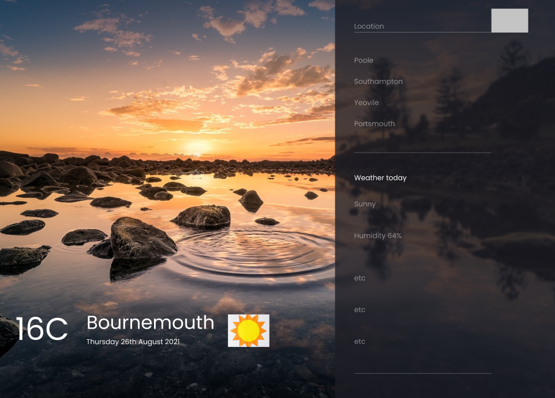
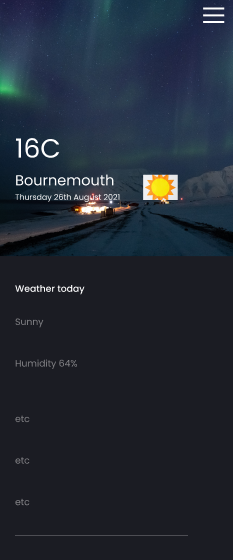
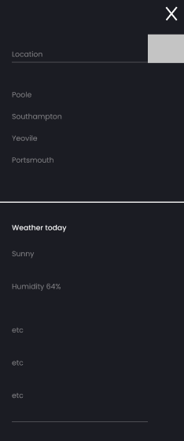
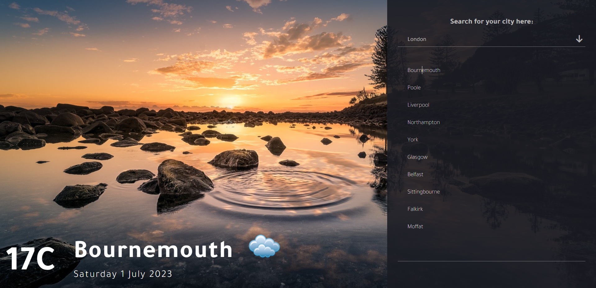
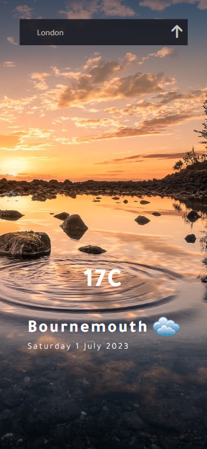

# Description

This is a simple weather app. It uses a JSON file of places to loop through, then uses an API to see the weather for that current place. 

# Installation 

## Clone this repo 
```bash 
git clone https://github.com/Beckibuzz93/Weather-App
```

# Technologies used
1. HTML
2. Custom CSS
3. React JS

# UX Design 
## Pre Designs before building
 

 
 

# App Pictures 

## Landing page
 

## Landing on mobile
 

# Credits
## This project was created by: 

[Becki: Beckibuzz93](https://github.com/Beckibuzz93)
